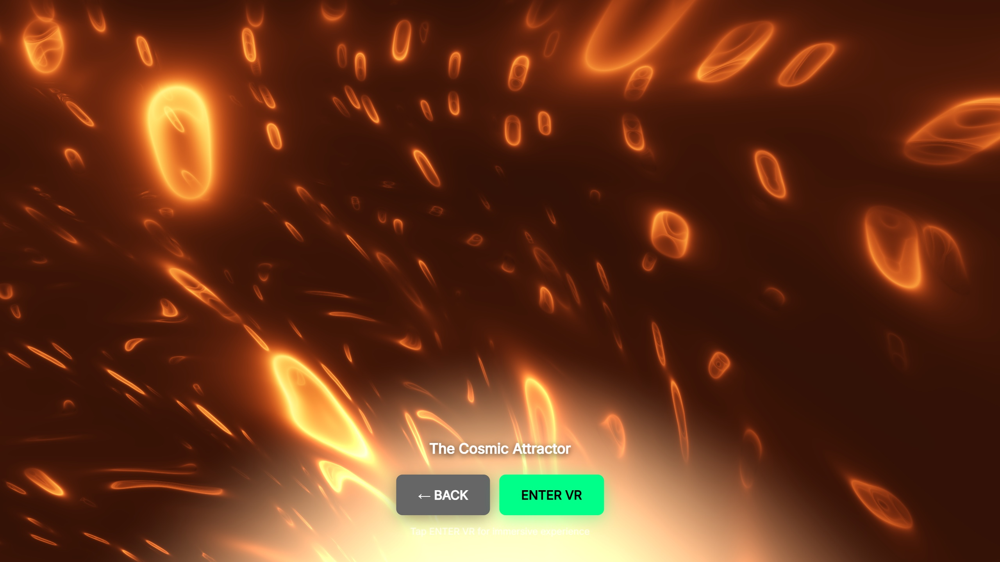
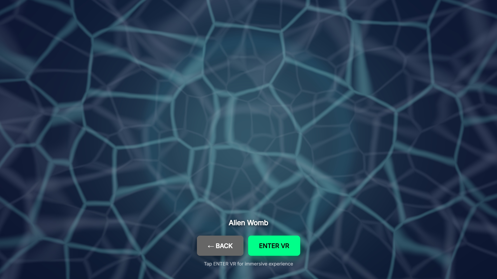
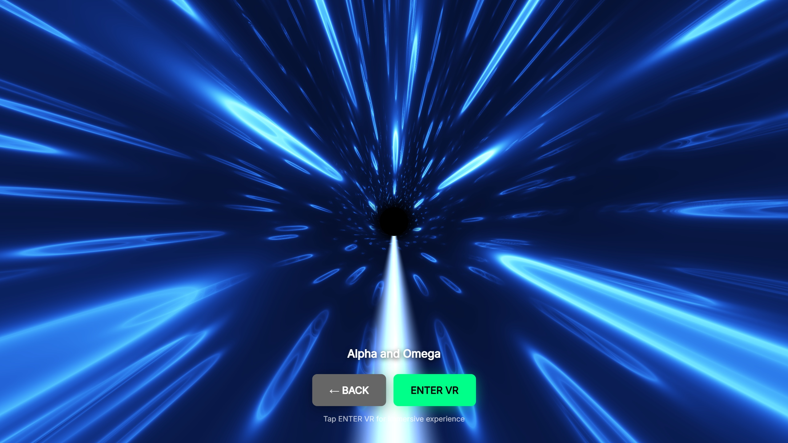
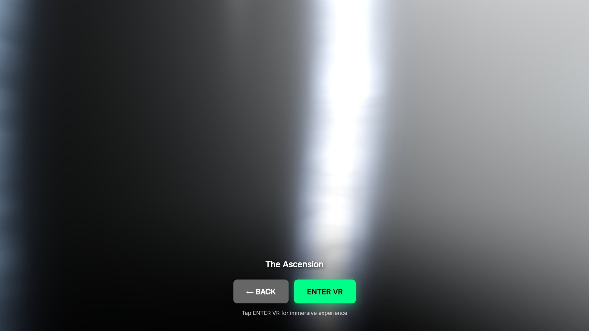

# Ontik

**Immersive WebXR worlds exploring altered perception through light, motion and sound.**

[Enter Ontik](https://ontik.app)



Ontik is a series of navigable audiovisual environments built with WebXR, Three.js and custom GLSL shaders. Rather than using VR to simulate ordinary space, the project constructs unfamiliar perceptual worlds organized around atmosphere, scale, movement and sensory intensity.

The work draws on phenomenology, mystical experience, psychedelic aesthetics and contemplative practice, while remaining an artwork rather than a model of any single state of consciousness.

## The experience

Ontik currently includes a longer contemplative journey alongside several shorter experimental environments. Across them, the emphasis is on:

- shifting the felt relation between body, space and scale
- using light and motion as primary compositional materials
- creating environments that move between awe, estrangement and attraction
- treating immersive space itself as an artistic medium

A VR headset offers the strongest experience, but the worlds can also be entered from a desktop browser.

## Selected environments

| The Cosmic Attractor | Alien Womb |
| --- | --- |
|  |  |

| Alpha and Omega | The Ascension |
| --- | --- |
|  |  |

## Technical approach

- **WebXR** — immersive browser-based delivery
- **Three.js** — scene architecture and rendering
- **GLSL shaders** — real-time visual systems
- **JavaScript / HTML** — interaction and application structure
- **Spatial audio** — sound as part of the perceptual environment

## Run locally

```bash
git clone https://github.com/danrezi-gif/Ontik-vr-shader-experience.git
cd Ontik-vr-shader-experience
python -m http.server 8000
```

or:

```bash
npx http-server
```

Open the local server in a browser. WebXR requires HTTPS outside local development.

## Artistic context

The recurring question behind Ontik is simple: **what happens when an environment is composed not primarily as a place to represent, but as a way of reorganizing experience?**

The project belongs to a wider body of work concerned with altered perception, mystical and visionary experience, artificial environments and the relationship between consciousness and technology.

Ontik is part of [Monkadelic](https://monkadelic.me), Daniel Rezinovsky's experimental artistic practice.

## Connect

- [Monkadelic](https://monkadelic.me)
- [Daniel Rezinovsky](https://danielrezinovsky.com)
- [Instagram @monkadelic_](https://www.instagram.com/monkadelic_/)

## License

MIT — see [LICENSE](LICENSE).